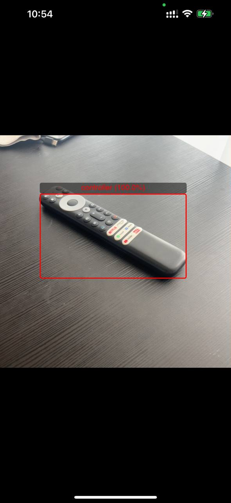
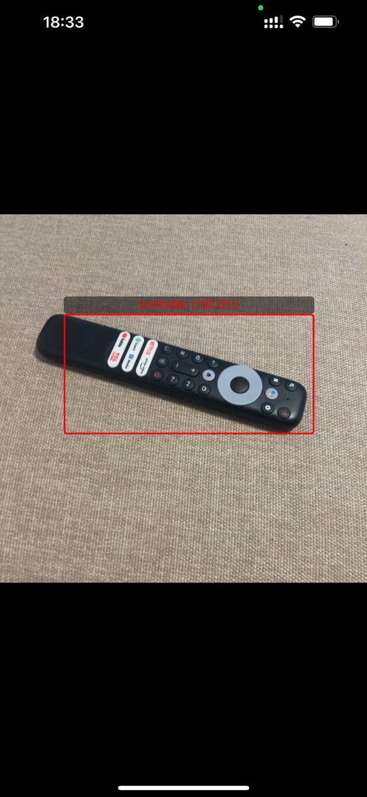
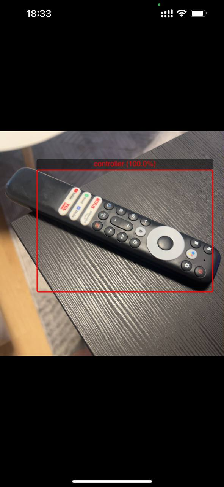

# 📦 Computer Vision - Object detection - tv remote

Demo of Machine Learning to recognize 
tv-remote on the realtime iphone camera
and presenting red rect for recognized object(ig score is more than 0.5).  
4 models are trained with 4 different tools: Apple CreateML, Ultralytics, Pytorch, Tensorflow.

Note: some parts are not yet refactored and pythons' scripts for Pytorch, Tensorflow aren't fully finished. 

---

## 🚀 Features

- Pytorch. "pt" folder.
- Tensorflow. "tf" folder.
- Ultralytics tool.
- Create Ml app from Apple.
- Fully custom dataset. *Small for that kind of training.  
- Pillow. Working with images
- Numpy. To work with objects and arrays.
- Json. 
- Matplotlib. to visualize results 
- tqdm. to show progress bar for training process.
- CNN.
- Checkpoints. Used to restore last epoch if something happened within train process.
- ReduceLROnPlateau. Used to dynamically change Learning_rate.
- stop_counter. Used to stop training if training-metrics isn't improving.
- test_models.py. Tests and compare two models from TF and PT.
- convert_to_coreml.py. Converts both TF and PT models to CoreML(to use on the ios, osx)
- iOS UKKit apps used to work with converted CoreML and TFLite models.

---

## 🖼 Screenshots

###  iOS test 1



### iOS test 2



### iOS test 2



---

## 🛠 Setup

```
## Python
git clone https://github.com/genry86/object-detection-remote
cd object-detection-remote
 
Use "pt" folder to work with pytorch. "train.py"
User "tf" to work with tensorflow. "train.py"

For ultralytics:
 - register account on their website(free).
 - create object-detection project.
 - upload dataset using "dataset" folder. 
 - download their script for local training or copy training key and insert it to existing script.
 - run `python train.py`
   
For create-ml:
- create `object-detection` project
- upload training images and validation images from dataset folder.
- start training

Converting.
"convert_to_coreml.py" is used to convert pytorch/tensorflow models to CoreML types, to use in Xcode.
CreateML model is native for xcode and can be used as is.
Ultralytics model may be converted with terminal command like:
`yolo export model=runs/detect/train/weights/best.pt format=coreml optimize=False half=False`

## iOS
cd iOS
pod install
run ObjDetector.xcworkspace
Use your provision profile.
# iOS will use real-time camera to get photos and using selected model tv-remote will be recognized with red rect(see screenshots) 
